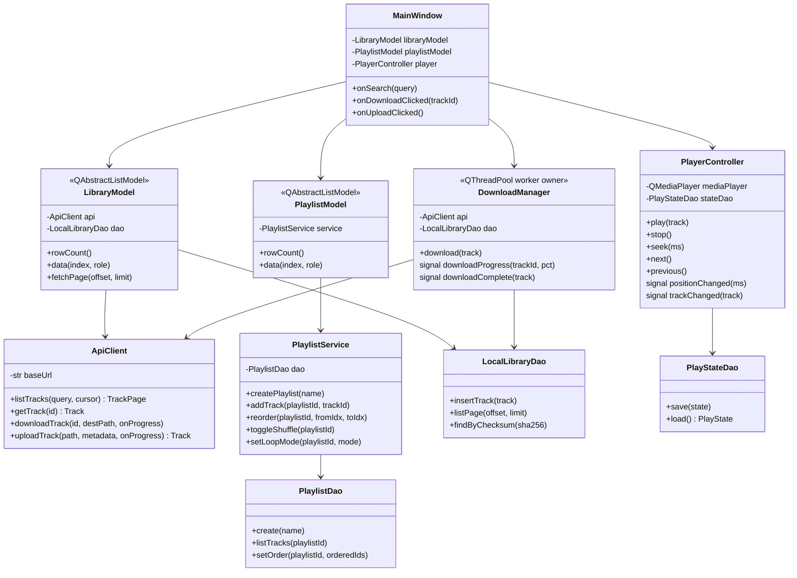

# Class — Client architecture (key classes)

```mermaid
classDiagram
    class MainWindow {
        -LibraryModel libraryModel
        -PlaylistModel playlistModel
        -PlayerController player
        +onSearch(query)
        +onDownloadClicked(trackId)
        +onUploadClicked()
    }

    class LibraryModel {
        <<QAbstractListModel>>
        -ApiClient api
        -LocalLibraryDao dao
        +rowCount()
        +data(index, role)
        +fetchPage(offset, limit)
    }

    class PlaylistModel {
        <<QAbstractListModel>>
        -PlaylistService service
        +rowCount()
        +data(index, role)
    }

    class ApiClient {
        -str baseUrl
        +listTracks(query, cursor) TrackPage
        +getTrack(id) Track
        +downloadTrack(id, destPath, onProgress)
        +uploadTrack(path, metadata, onProgress) Track
    }

    class DownloadManager {
        <<QThreadPool worker owner>>
        -ApiClient api
        -LocalLibraryDao dao
        +download(track) 
        signal downloadProgress(trackId, pct)
        signal downloadComplete(track)
    }

    class PlaylistService {
        -PlaylistDao dao
        +createPlaylist(name)
        +addTrack(playlistId, trackId)
        +reorder(playlistId, fromIdx, toIdx)
        +toggleShuffle(playlistId)
        +setLoopMode(playlistId, mode)
    }

    class PlayerController {
        -QMediaPlayer mediaPlayer
        -PlayStateDao stateDao
        +play(track)
        +stop()
        +seek(ms)
        +next()
        +previous()
        signal positionChanged(ms)
        signal trackChanged(track)
    }

    class LocalLibraryDao {
        +insertTrack(track)
        +listPage(offset, limit)
        +findByChecksum(sha256)
    }

    class PlaylistDao {
        +create(name)
        +listTracks(playlistId)
        +setOrder(playlistId, orderedIds)
    }

    class PlayStateDao {
        +save(state)
        +load() PlayState
    }

    MainWindow --> LibraryModel
    MainWindow --> PlaylistModel
    MainWindow --> PlayerController
    LibraryModel --> ApiClient
    LibraryModel --> LocalLibraryDao
    PlaylistModel --> PlaylistService
    PlaylistService --> PlaylistDao
    PlayerController --> PlayStateDao
    DownloadManager --> ApiClient
    DownloadManager --> LocalLibraryDao
    MainWindow --> DownloadManager
```
