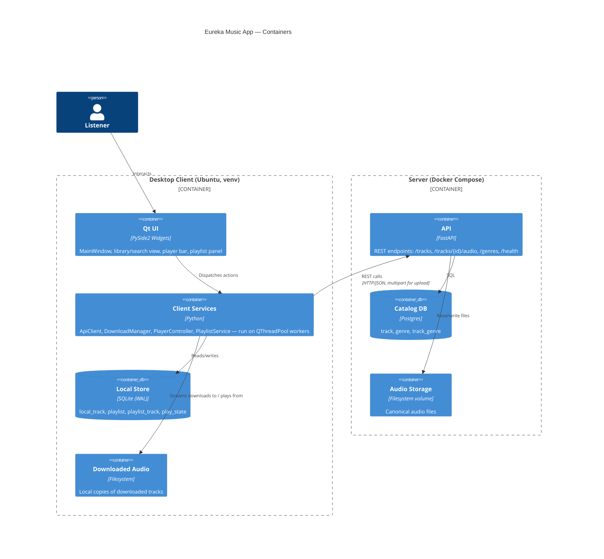

# C4 — Container

```mermaid
C4Container
    title Eureka Music App — Containers

    Person(user, "Listener")

    Container_Boundary(clientBoundary, "Desktop Client (Ubuntu, venv)") {
        Container(ui, "Qt UI", "PySide2 Widgets", "MainWindow, library/search view, player bar, playlist panel")
        Container(services, "Client Services", "Python", "ApiClient, DownloadManager, PlayerController, PlaylistService — run on QThreadPool workers")
        ContainerDb(clientdb, "Local Store", "SQLite (WAL)", "local_track, playlist, playlist_track, play_state")
        Container(files, "Downloaded Audio", "Filesystem", "Local copies of downloaded tracks")
    }

    Container_Boundary(serverBoundary, "Server (Docker Compose)") {
        Container(api, "API", "FastAPI", "REST endpoints: /tracks, /tracks/{id}/audio, /genres, /health")
        ContainerDb(db, "Catalog DB", "Postgres", "track, genre, track_genre")
        Container(storage, "Audio Storage", "Filesystem volume", "Canonical audio files")
    }

    Rel(user, ui, "Interacts")
    Rel(ui, services, "Dispatches actions")
    Rel(services, clientdb, "Reads/writes")
    Rel(services, files, "Streams downloads to / plays from")
    Rel(services, api, "REST calls", "HTTP/JSON, multipart for upload")
    Rel(api, db, "SQL")
    Rel(api, storage, "Read/write files")
```
