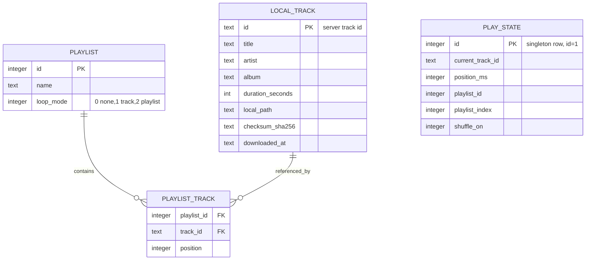

# ERD — Client (SQLite)

```mermaid
erDiagram
    LOCAL_TRACK {
        text id PK "server track id"
        text title
        text artist
        text album
        int  duration_seconds
        text local_path
        text checksum_sha256
        text downloaded_at
    }
    PLAYLIST {
        integer id PK
        text name
        integer loop_mode "0 none,1 track,2 playlist"
    }
    PLAYLIST_TRACK {
        integer playlist_id FK
        text track_id FK
        integer position
    }
    PLAY_STATE {
        integer id PK "singleton row, id=1"
        text current_track_id
        integer position_ms
        integer playlist_id
        integer playlist_index
        integer shuffle_on
    }
    PLAYLIST ||--o{ PLAYLIST_TRACK : contains
    LOCAL_TRACK ||--o{ PLAYLIST_TRACK : referenced_by
```

See [DESIGN.md §4.2](../../DESIGN.md#42-data-model-client--sqlite) for
rationale, especially why shuffle never mutates `position`.
