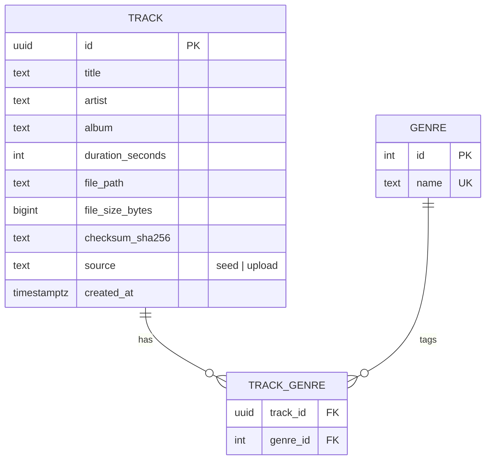

# ERD — Server (Postgres)

```mermaid
erDiagram
    TRACK {
        uuid id PK
        text title
        text artist
        text album
        int  duration_seconds
        text file_path
        bigint file_size_bytes
        text checksum_sha256
        text source "seed | upload"
        timestamptz created_at
    }
    GENRE {
        int id PK
        text name UK
    }
    TRACK_GENRE {
        uuid track_id FK
        int genre_id FK
    }
    TRACK ||--o{ TRACK_GENRE : has
    GENRE ||--o{ TRACK_GENRE : tags
```

See [DESIGN.md §3.2](../../DESIGN.md#32-data-model-server--postgres) for
indexing and rationale.
