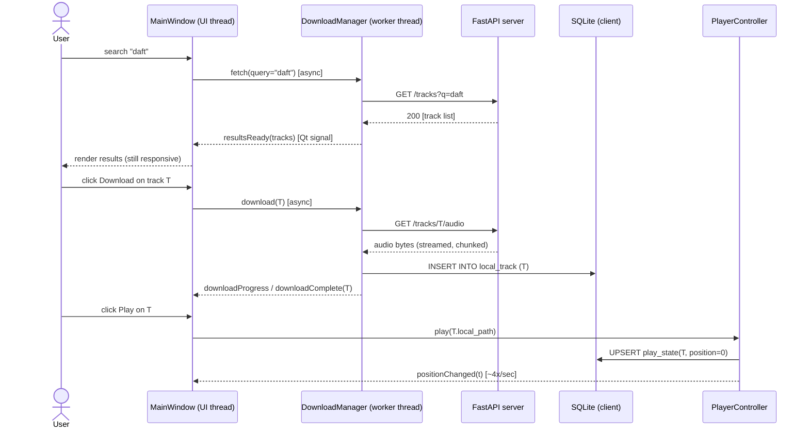

# Sequence — Browse, download, play

```mermaid
sequenceDiagram
    actor U as User
    participant UI as MainWindow (UI thread)
    participant DM as DownloadManager (worker thread)
    participant API as FastAPI server
    participant DB as SQLite (client)
    participant P as PlayerController

    U->>UI: search "daft"
    UI->>DM: fetch(query="daft") [async]
    DM->>API: GET /tracks?q=daft
    API-->>DM: 200 [track list]
    DM-->>UI: resultsReady(tracks) [Qt signal]
    UI-->>U: render results (still responsive)

    U->>UI: click Download on track T
    UI->>DM: download(T) [async]
    DM->>API: GET /tracks/T/audio
    API-->>DM: audio bytes (streamed, chunked)
    DM->>DB: INSERT INTO local_track (T)
    DM-->>UI: downloadProgress / downloadComplete(T)

    U->>UI: click Play on T
    UI->>P: play(T.local_path)
    P->>DB: UPSERT play_state(T, position=0)
    P-->>UI: positionChanged(t) [~4x/sec]
```
