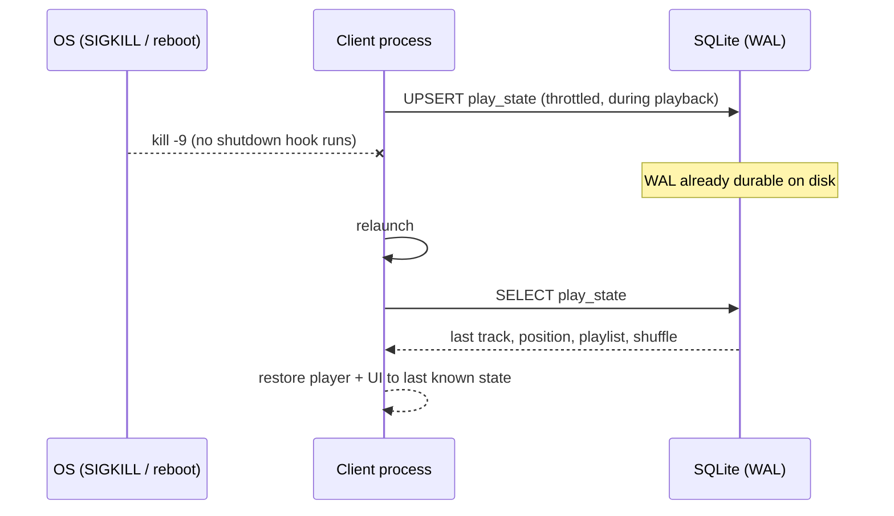

# Sequence — Crash-safe resume

```mermaid
sequenceDiagram
    participant OS as OS (SIGKILL / reboot)
    participant App as Client process
    participant DB as SQLite (WAL)

    App->>DB: UPSERT play_state (throttled, during playback)
    OS--xApp: kill -9 (no shutdown hook runs)
    Note over DB: WAL already durable on disk
    App->>App: relaunch
    App->>DB: SELECT play_state
    DB-->>App: last track, position, playlist, shuffle
    App-->>App: restore player + UI to last known state
```
