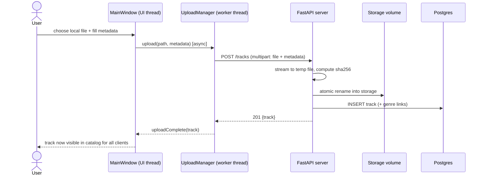

# Sequence — Upload local track to server

```mermaid
sequenceDiagram
    actor U as User
    participant UI as MainWindow (UI thread)
    participant UM as UploadManager (worker thread)
    participant API as FastAPI server
    participant ST as Storage volume
    participant DB as Postgres

    U->>UI: choose local file + fill metadata
    UI->>UM: upload(path, metadata) [async]
    UM->>API: POST /tracks (multipart: file + metadata)
    API->>API: stream to temp file, compute sha256
    API->>ST: atomic rename into storage
    API->>DB: INSERT track (+ genre links)
    API-->>UM: 201 {track}
    UM-->>UI: uploadComplete(track)
    UI-->>U: track now visible in catalog for all clients
```
